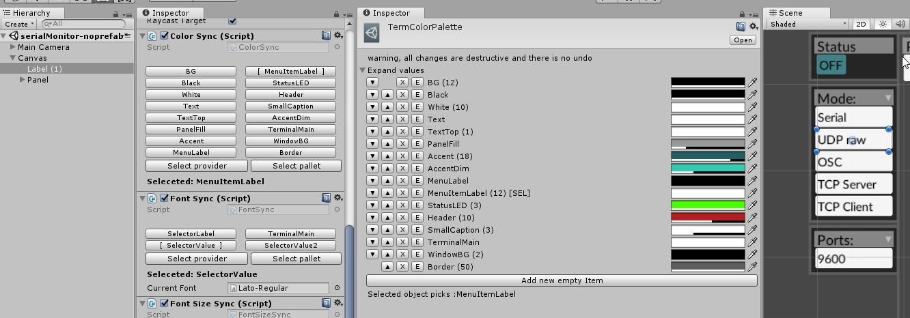
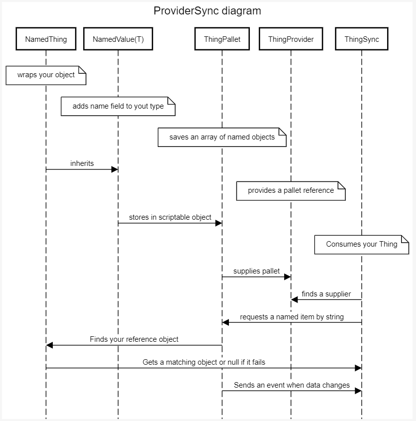

# Palette Sync:

If you are not a fan of prefabs, or you need to switch betwen UI themes. The idea came to mind when needing to do color synchonising utility (to enable color switching per application), than I wanted to synchronize font sizes and fonts. Two rewrites later here we are, this is a collection of four templates, with an inheritance structure that gives you a set of inspector tools: 

The tools are : Syncers, that assign a nametag to a value and apply that value to the target component, Palettes that enable you to edit and order elements within a set (implemented as ScriptableObjects), ans Providers, which propagate events and 'direct' syncers when they wake up (OnEnable) to the current Palette to use.

Its primary use would be the UI system (centralised styling of UI elements, indepent of the prefab system), but its not tied to UI and you can extend it for most of Unity object types (as long as they serialize)

## Editors:

SyncPalette has been designed as a universal tool that enables you to form a dictionary, linking a name with a value, and providing an entry point to scripting basic interaction, so where the value is Color and you define "background" color as Black, and you sync all your images to refer to "background", you can later define background as any color.

The Syncer type component links to your target "actuator" component, and feeds it with a new value, if the reference value changes.

The idea was that most of the functionality in providing name-value paris is identical regardless of type of the value, this is an attempt to provide common functional, extendable core fors such assignment

## Structure:

- NamedValue < T > which wraps your T together with a string identifier
- a Scriptable Object (PaletteBase) which stores a list of named values <NT>, this is again is a wrapper that stores a collection. 
- SyncValue < T > - this is a utiliy you add to all your target elements. It stores an named identifier of the value or object you want to refer to, and feeds it to the target component in a freely definable way 
- ValueProvider < T > a Singleton type component that forms a link between a Palette and Syncers, so change to the Palette propagate to target components 

### A Diagram, 

## Pros:

- Works in the same manner in Editor and in Runtime
- Works for pretty much everything from floats to prefabs, you can define the way you interact with the object, so there are exotic examples like controlling your Horizontal and Vertical layout groups,
- All changes to the palette seemed to serialize almost fine, so you can tweak in runtime and changes get saved.

## Cons:

- Some bugfixing needed
- All changes to the palette seemed to serialize almost fine, so you can tweak in runtime and changes get saved. Please use version control a lot when using this extension, or at least keep copies of scriptable objects and mind that unity version changes might break stuff.
- If syncing stops working, try disabling and reenabling your canvas, it forces event re-subscription

### Note on generics:

Overall structure of the code might seem convoluted at first (well, it is much more convoluted than it should be), but a lot of the complexity is there just to make sure it all works predictable with unity's Serialisation mechanisms, to to enable easier creation of own custom components. Unity has its own way of taking generics and its a bit more verbose than it could have been, but hey at least it works

### TODOs: 
- Currently adding new values into one Pallete base makes it ahead of other palletes. A mechanism should be designed to propagate changes such as item rename, (and enables syncer objects to know of the change, I am not sure how to do this i a safe manner)
- between some versions of the Editor, there are inconsitiencies between serialisation order, constructor order, event propagation seems to differ in some cases. I tried to catch many of such cases but there are still things that could use a few #ifs 
